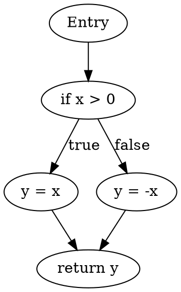

Creating a Control Flow Graph (CFG) and performing Data Flow Analysis involves several steps. Here’s a structured approach to guide you through the process.

### 1. Understanding Control Flow Graph (CFG)

A Control Flow Graph is a representation of all the paths that might be traversed through a program during its execution. It consists of:

- **Nodes**: Represent basic blocks of code (a sequence of instructions without any jumps or branches).
- **Edges**: Indicate the flow of control from one basic block to another.

### 2. Creating the CFG

To generate a CFG, follow these steps:

1. **Identify Basic Blocks**: Break down the program into basic blocks. Each block should be a linear sequence of code with no jumps or branches, except for entry and exit points.

2. **Determine Control Flow**: Identify where branches (like if statements, loops, and function calls) occur. Draw edges between blocks based on possible paths of execution.

3. **Draw the Graph**: Use a directed graph representation where:
   - Each basic block is a node.
   - Each control flow decision results in directed edges between nodes.

### 3. Tools for CFG Generation

Here are some tools that can assist in generating CFGs and performing data flow analysis:

1. **Graphviz**: A popular open-source graph visualization software. You can define your CFG in DOT language and use Graphviz to render it.
   - **Pros**: Highly customizable, easy to use for simple graphs.
   - **Cons**: Manual creation of the graph might be time-consuming for complex programs.

2. **LLVM**: A compiler framework that provides tools for generating CFGs and performing various analyses.
   - **Pros**: Powerful for advanced optimizations and analyses, supports multiple languages.
   - **Cons**: Requires knowledge of LLVM’s architecture and tools.

3. **Code Analysis Tools**: Tools like **SonarQube**, **FindBugs**, or **Pylint** can provide insights into control flows and variable lifetimes.
   - **Pros**: Automated analysis, can catch various code issues.
   - **Cons**: May not provide visual representation directly.

### 4. Data Flow Analysis

Data Flow Analysis (DFA) involves tracking the flow of data across the program to understand variable lifetimes, dependencies, and usage patterns. Here’s how to perform it:

1. **Define Data Flow Facts**: Determine what data you want to analyze (e.g., definitions, uses, live variables).

2. **Analyze Each Block**: For each basic block, analyze how variables are defined, used, and modified. Maintain a set of facts for each block.

3. **Propagation of Data Flow Facts**: Propagate data flow facts across the CFG edges. This often involves:
   - **In-edges**: Collecting facts coming into the block.
   - **Out-edges**: Determining the facts that exit the block.

4. **Convergence**: Repeat the analysis until the data flow facts converge (i.e., no new information is gained).

### 5. Example: CFG Generation

Here’s a simple example to illustrate CFG generation:

#### Sample Code
```python
def example_function(x):
    if x > 0:
        y = x
    else:
        y = -x
    return y
```

#### CFG Representation

- **Basic Blocks**:
  - Block 1: Entry
  - Block 2: `if x > 0`
  - Block 3: `y = x`
  - Block 4: `y = -x`
  - Block 5: `return y`

- **Edges**:
  - Entry → Block 2
  - Block 2 → Block 3 (if true)
  - Block 2 → Block 4 (if false)
  - Block 3 → Block 5
  - Block 4 → Block 5

#### Visual Representation
Using a tool like Graphviz, you can represent the CFG in DOT format:



### Conclusion

By creating a Control Flow Graph and conducting Data Flow Analysis, you can gain deep insights into your program's execution paths and variable usage. You can use tools like Graphviz or LLVM to automate and visualize this process effectively. If you have a specific program or code snippet in mind, let me know, and I can assist you further with a tailored CFG and analysis.
